Step Up Academically
================
Catherine Chalikian
5/6/2022

## Do regular steps of &gt; 10,000 average steps per day cause a higher GPA in 2017 Freshman at Oral Roberts University?

To answer this question, we will look at a dataset of 581 incoming
Freshman at Oral Robert University (ORU) in 2017. The dataset comes from
a class called “Introduction to Whole Person Education”, which required
several health measures, including a timed mile, daily steps tracked by
Fitbit, and daily active minutes in different heart rate zones. The
10,000 step mark is both from common recommendations, as well as the
course recommendation. To ensure that this was a reasonable measure–that
there would be sufficient treatment and control populations–we looked at
the histogram below. There are indeed numerous participants in both
groups.

``` r
dat = read.csv("FitbitsAndGradesData_Fall2017.csv")
names(dat) = tolower(names(dat))
```

``` r
ggplot(dat)+
  geom_histogram(bins = 30,
                 aes(x = steps),
                 fill = "turquoise3")+
  geom_label(
    label = "Average Daily Steps",
    x = 16500,
    y = 50
  )+
  labs(title = "Frequency of Average Daily Steps")
```

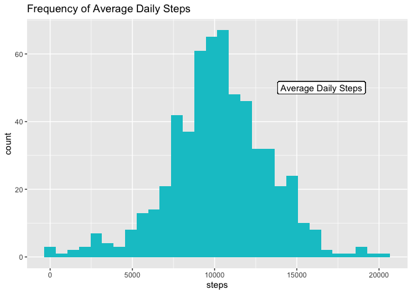<!-- -->

## Missing Data? Nope.

``` r
# visualize data
dat %>% vis_dat()
```

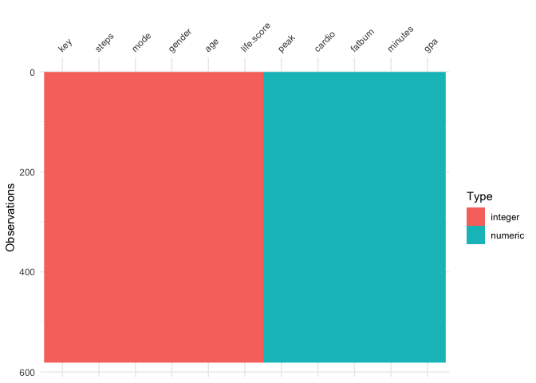<!-- -->

It appears that we no missing data, so we do not need to impute it.
However, we do need to create a variable denoting treatment or control.
As of now, our exposure *steps* is a continuous variable, but we want to
know whether or not the participant is in the treatment group or not. We
must also make *gender* a factor variable so that we can get the most
information during all of our analysis.

``` r
# make our exposure var stepsT
dat$stepsT = ifelse(dat$steps > 10000, 1, 0)

# make gender factor var
dat$gender = factor(dat$gender)
```

Let’s move on and brainstorm how these variables might fit together.

## What are the relationships of the variables?

Our exposure, the average number of daily steps, could depend on a
number of things, including activity level. The variables *fatburn*,
*cardio*, and *peak* measure the number of minutes in the following
respective heart rates when compared to max heart rate: 50-69%, 70-84%,
and &gt;85%. This means that each of the variables is accounting for
different activity, so we will include all of them. Additionally, stress
levels (*stress*) could impact how many steps a student takes. There is
a small distribution of *age*, given that this dataset is about Freshman
specifically,

``` r
ggplot(dat)+
  geom_histogram(bins = 30,
                 aes(x = age),
                 fill = "turquoise3")+
  labs(title = "Frequency of Freshman Ages")+
  labs(x = "Age", y = "Count")
```

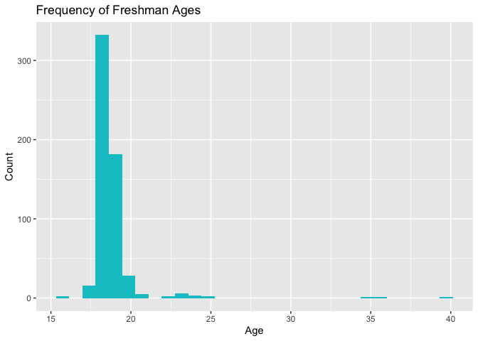<!-- -->

but it may make a difference. *Gender* may play a role. And finally
*distance* from campus would likely impact number of steps. The ORU
course also calculated a single score called *life score* based on a
35-question survey. This included more comprehensive elements of health,
such as alcohol and drug use, psychological condition, spirituality, and
nutrition in addition to fitness. The lower the score, the healthier the
person.

Then, our outcome *GPA* could be affected by *age*, *gender*, study
habits (*study*), *major*, and *life score*.

Based on gender stereotypes, we think that *cardio*, *fatburn*, and
*peak* could be influenced by *gender*.

``` r
dag = dagify(
  stepsT ~ stress + distance + peak + fatburn + cardio + minutes +
    age + gender + life.score,
  gpa ~ study + major + age + gender + life.score,
  cardio ~ gender,
  fatburn ~ gender,
  peak ~ gender,
  exposure = "stepsT",
  outcome = "gpa"
)

dag %>%
  ggdag()+
  geom_dag_node(color = "turquoise3")+
  geom_dag_text(color = "gray40") +
  theme_dag_gray()
```

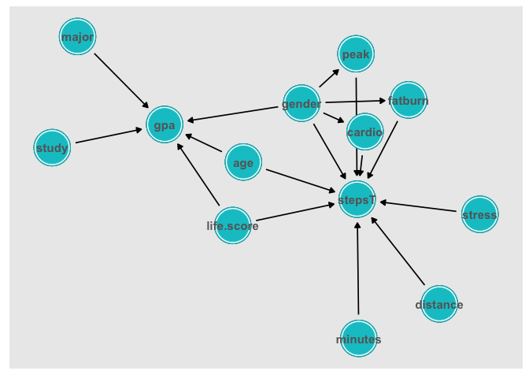<!-- -->

We can visualize the previously described relashionships with the above
Directed Acylcic Graph (DAG). Operations on this figure can help us
identify which variables are confounders, influencing both the exposure
and the outcome, as well as identify which covariates we need to adjust
for to effectively close off this influence. So, that’s what we’ll do
next with our open paths and adjustment sets.

``` r
dag %>% ggdag_paths()+
  geom_dag_node(color = "turquoise3")+
  geom_dag_text(color = "gray40") # add labels
```

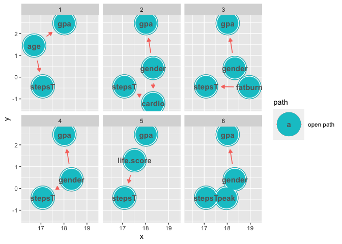<!-- -->

There are numerous open or backdoor paths that could lead us to a
spurious result. Now let’s see what we should adjust for to avoid such
calamity.

``` r
dag %>% ggdag_adjustment_set()+
  geom_dag_text(color = "gray40") # add labels
```

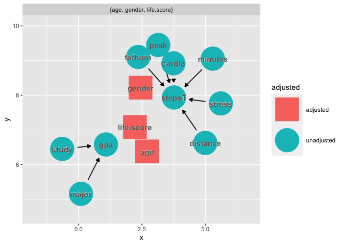<!-- -->

Our adjustment set is composed of the covariates *age*, *gender*, and
*life.score*. We know that if assignment to treatment is unconfounded
given the full set of covariates, then the assignment is also
unconfounded by conditioning only on the propensity score, so we
condition on the propensity score. This means that it’s time to build a
propensity score model!

### Propensity Scores and More

``` r
# propensity score, unweighted
glm1 = glm(stepsT ~ age + gender + life.score,
           data = dat,
           family = binomial())

# adding propensity scores to model
dat = glm1 %>% augment(type.predict = "response",
                       data = dat)
```

Let’s see how our populations compare without weighting.

``` r
svy_des = svydesign(
  ids = ~1,
  data = dat
)

table1 = svy_des %>% tbl_svysummary(
  by = stepsT,
  include = c("age", "gender", "life.score")
) %>%
  add_overall()
table1
```

<div id="timnarldqt" style="overflow-x:auto;overflow-y:auto;width:auto;height:auto;">
<style>html {
  font-family: -apple-system, BlinkMacSystemFont, 'Segoe UI', Roboto, Oxygen, Ubuntu, Cantarell, 'Helvetica Neue', 'Fira Sans', 'Droid Sans', Arial, sans-serif;
}

#timnarldqt .gt_table {
  display: table;
  border-collapse: collapse;
  margin-left: auto;
  margin-right: auto;
  color: #333333;
  font-size: 16px;
  font-weight: normal;
  font-style: normal;
  background-color: #FFFFFF;
  width: auto;
  border-top-style: solid;
  border-top-width: 2px;
  border-top-color: #A8A8A8;
  border-right-style: none;
  border-right-width: 2px;
  border-right-color: #D3D3D3;
  border-bottom-style: solid;
  border-bottom-width: 2px;
  border-bottom-color: #A8A8A8;
  border-left-style: none;
  border-left-width: 2px;
  border-left-color: #D3D3D3;
}

#timnarldqt .gt_heading {
  background-color: #FFFFFF;
  text-align: center;
  border-bottom-color: #FFFFFF;
  border-left-style: none;
  border-left-width: 1px;
  border-left-color: #D3D3D3;
  border-right-style: none;
  border-right-width: 1px;
  border-right-color: #D3D3D3;
}

#timnarldqt .gt_title {
  color: #333333;
  font-size: 125%;
  font-weight: initial;
  padding-top: 4px;
  padding-bottom: 4px;
  padding-left: 5px;
  padding-right: 5px;
  border-bottom-color: #FFFFFF;
  border-bottom-width: 0;
}

#timnarldqt .gt_subtitle {
  color: #333333;
  font-size: 85%;
  font-weight: initial;
  padding-top: 0;
  padding-bottom: 6px;
  padding-left: 5px;
  padding-right: 5px;
  border-top-color: #FFFFFF;
  border-top-width: 0;
}

#timnarldqt .gt_bottom_border {
  border-bottom-style: solid;
  border-bottom-width: 2px;
  border-bottom-color: #D3D3D3;
}

#timnarldqt .gt_col_headings {
  border-top-style: solid;
  border-top-width: 2px;
  border-top-color: #D3D3D3;
  border-bottom-style: solid;
  border-bottom-width: 2px;
  border-bottom-color: #D3D3D3;
  border-left-style: none;
  border-left-width: 1px;
  border-left-color: #D3D3D3;
  border-right-style: none;
  border-right-width: 1px;
  border-right-color: #D3D3D3;
}

#timnarldqt .gt_col_heading {
  color: #333333;
  background-color: #FFFFFF;
  font-size: 100%;
  font-weight: normal;
  text-transform: inherit;
  border-left-style: none;
  border-left-width: 1px;
  border-left-color: #D3D3D3;
  border-right-style: none;
  border-right-width: 1px;
  border-right-color: #D3D3D3;
  vertical-align: bottom;
  padding-top: 5px;
  padding-bottom: 6px;
  padding-left: 5px;
  padding-right: 5px;
  overflow-x: hidden;
}

#timnarldqt .gt_column_spanner_outer {
  color: #333333;
  background-color: #FFFFFF;
  font-size: 100%;
  font-weight: normal;
  text-transform: inherit;
  padding-top: 0;
  padding-bottom: 0;
  padding-left: 4px;
  padding-right: 4px;
}

#timnarldqt .gt_column_spanner_outer:first-child {
  padding-left: 0;
}

#timnarldqt .gt_column_spanner_outer:last-child {
  padding-right: 0;
}

#timnarldqt .gt_column_spanner {
  border-bottom-style: solid;
  border-bottom-width: 2px;
  border-bottom-color: #D3D3D3;
  vertical-align: bottom;
  padding-top: 5px;
  padding-bottom: 5px;
  overflow-x: hidden;
  display: inline-block;
  width: 100%;
}

#timnarldqt .gt_group_heading {
  padding-top: 8px;
  padding-bottom: 8px;
  padding-left: 5px;
  padding-right: 5px;
  color: #333333;
  background-color: #FFFFFF;
  font-size: 100%;
  font-weight: initial;
  text-transform: inherit;
  border-top-style: solid;
  border-top-width: 2px;
  border-top-color: #D3D3D3;
  border-bottom-style: solid;
  border-bottom-width: 2px;
  border-bottom-color: #D3D3D3;
  border-left-style: none;
  border-left-width: 1px;
  border-left-color: #D3D3D3;
  border-right-style: none;
  border-right-width: 1px;
  border-right-color: #D3D3D3;
  vertical-align: middle;
}

#timnarldqt .gt_empty_group_heading {
  padding: 0.5px;
  color: #333333;
  background-color: #FFFFFF;
  font-size: 100%;
  font-weight: initial;
  border-top-style: solid;
  border-top-width: 2px;
  border-top-color: #D3D3D3;
  border-bottom-style: solid;
  border-bottom-width: 2px;
  border-bottom-color: #D3D3D3;
  vertical-align: middle;
}

#timnarldqt .gt_from_md > :first-child {
  margin-top: 0;
}

#timnarldqt .gt_from_md > :last-child {
  margin-bottom: 0;
}

#timnarldqt .gt_row {
  padding-top: 8px;
  padding-bottom: 8px;
  padding-left: 5px;
  padding-right: 5px;
  margin: 10px;
  border-top-style: solid;
  border-top-width: 1px;
  border-top-color: #D3D3D3;
  border-left-style: none;
  border-left-width: 1px;
  border-left-color: #D3D3D3;
  border-right-style: none;
  border-right-width: 1px;
  border-right-color: #D3D3D3;
  vertical-align: middle;
  overflow-x: hidden;
}

#timnarldqt .gt_stub {
  color: #333333;
  background-color: #FFFFFF;
  font-size: 100%;
  font-weight: initial;
  text-transform: inherit;
  border-right-style: solid;
  border-right-width: 2px;
  border-right-color: #D3D3D3;
  padding-left: 5px;
  padding-right: 5px;
}

#timnarldqt .gt_stub_row_group {
  color: #333333;
  background-color: #FFFFFF;
  font-size: 100%;
  font-weight: initial;
  text-transform: inherit;
  border-right-style: solid;
  border-right-width: 2px;
  border-right-color: #D3D3D3;
  padding-left: 5px;
  padding-right: 5px;
  vertical-align: top;
}

#timnarldqt .gt_row_group_first td {
  border-top-width: 2px;
}

#timnarldqt .gt_summary_row {
  color: #333333;
  background-color: #FFFFFF;
  text-transform: inherit;
  padding-top: 8px;
  padding-bottom: 8px;
  padding-left: 5px;
  padding-right: 5px;
}

#timnarldqt .gt_first_summary_row {
  border-top-style: solid;
  border-top-color: #D3D3D3;
}

#timnarldqt .gt_first_summary_row.thick {
  border-top-width: 2px;
}

#timnarldqt .gt_last_summary_row {
  padding-top: 8px;
  padding-bottom: 8px;
  padding-left: 5px;
  padding-right: 5px;
  border-bottom-style: solid;
  border-bottom-width: 2px;
  border-bottom-color: #D3D3D3;
}

#timnarldqt .gt_grand_summary_row {
  color: #333333;
  background-color: #FFFFFF;
  text-transform: inherit;
  padding-top: 8px;
  padding-bottom: 8px;
  padding-left: 5px;
  padding-right: 5px;
}

#timnarldqt .gt_first_grand_summary_row {
  padding-top: 8px;
  padding-bottom: 8px;
  padding-left: 5px;
  padding-right: 5px;
  border-top-style: double;
  border-top-width: 6px;
  border-top-color: #D3D3D3;
}

#timnarldqt .gt_striped {
  background-color: rgba(128, 128, 128, 0.05);
}

#timnarldqt .gt_table_body {
  border-top-style: solid;
  border-top-width: 2px;
  border-top-color: #D3D3D3;
  border-bottom-style: solid;
  border-bottom-width: 2px;
  border-bottom-color: #D3D3D3;
}

#timnarldqt .gt_footnotes {
  color: #333333;
  background-color: #FFFFFF;
  border-bottom-style: none;
  border-bottom-width: 2px;
  border-bottom-color: #D3D3D3;
  border-left-style: none;
  border-left-width: 2px;
  border-left-color: #D3D3D3;
  border-right-style: none;
  border-right-width: 2px;
  border-right-color: #D3D3D3;
}

#timnarldqt .gt_footnote {
  margin: 0px;
  font-size: 90%;
  padding-left: 4px;
  padding-right: 4px;
  padding-left: 5px;
  padding-right: 5px;
}

#timnarldqt .gt_sourcenotes {
  color: #333333;
  background-color: #FFFFFF;
  border-bottom-style: none;
  border-bottom-width: 2px;
  border-bottom-color: #D3D3D3;
  border-left-style: none;
  border-left-width: 2px;
  border-left-color: #D3D3D3;
  border-right-style: none;
  border-right-width: 2px;
  border-right-color: #D3D3D3;
}

#timnarldqt .gt_sourcenote {
  font-size: 90%;
  padding-top: 4px;
  padding-bottom: 4px;
  padding-left: 5px;
  padding-right: 5px;
}

#timnarldqt .gt_left {
  text-align: left;
}

#timnarldqt .gt_center {
  text-align: center;
}

#timnarldqt .gt_right {
  text-align: right;
  font-variant-numeric: tabular-nums;
}

#timnarldqt .gt_font_normal {
  font-weight: normal;
}

#timnarldqt .gt_font_bold {
  font-weight: bold;
}

#timnarldqt .gt_font_italic {
  font-style: italic;
}

#timnarldqt .gt_super {
  font-size: 65%;
}

#timnarldqt .gt_footnote_marks {
  font-style: italic;
  font-weight: normal;
  font-size: 75%;
  vertical-align: 0.4em;
}

#timnarldqt .gt_asterisk {
  font-size: 100%;
  vertical-align: 0;
}

#timnarldqt .gt_slash_mark {
  font-size: 0.7em;
  line-height: 0.7em;
  vertical-align: 0.15em;
}

#timnarldqt .gt_fraction_numerator {
  font-size: 0.6em;
  line-height: 0.6em;
  vertical-align: 0.45em;
}

#timnarldqt .gt_fraction_denominator {
  font-size: 0.6em;
  line-height: 0.6em;
  vertical-align: -0.05em;
}
</style>
<table class="gt_table">
  
  <thead class="gt_col_headings">
    <tr>
      <th class="gt_col_heading gt_columns_bottom_border gt_left" rowspan="1" colspan="1"><strong>Characteristic</strong></th>
      <th class="gt_col_heading gt_columns_bottom_border gt_center" rowspan="1" colspan="1"><strong>Overall</strong>, N = 581<sup class="gt_footnote_marks">1</sup></th>
      <th class="gt_col_heading gt_columns_bottom_border gt_center" rowspan="1" colspan="1"><strong>0</strong>, N = 267<sup class="gt_footnote_marks">1</sup></th>
      <th class="gt_col_heading gt_columns_bottom_border gt_center" rowspan="1" colspan="1"><strong>1</strong>, N = 314<sup class="gt_footnote_marks">1</sup></th>
    </tr>
  </thead>
  <tbody class="gt_table_body">
    <tr><td class="gt_row gt_left">age</td>
<td class="gt_row gt_center">18 (18, 19)</td>
<td class="gt_row gt_center">18 (18, 19)</td>
<td class="gt_row gt_center">18 (18, 19)</td></tr>
    <tr><td class="gt_row gt_left">gender</td>
<td class="gt_row gt_center"></td>
<td class="gt_row gt_center"></td>
<td class="gt_row gt_center"></td></tr>
    <tr><td class="gt_row gt_left" style="text-align: left; text-indent: 10px;">0</td>
<td class="gt_row gt_center">237 (41%)</td>
<td class="gt_row gt_center">106 (40%)</td>
<td class="gt_row gt_center">131 (42%)</td></tr>
    <tr><td class="gt_row gt_left" style="text-align: left; text-indent: 10px;">1</td>
<td class="gt_row gt_center">344 (59%)</td>
<td class="gt_row gt_center">161 (60%)</td>
<td class="gt_row gt_center">183 (58%)</td></tr>
    <tr><td class="gt_row gt_left">life.score</td>
<td class="gt_row gt_center">69 (57, 83)</td>
<td class="gt_row gt_center">71 (57, 84)</td>
<td class="gt_row gt_center">68 (58, 82)</td></tr>
  </tbody>
  
  <tfoot class="gt_footnotes">
    <tr>
      <td class="gt_footnote" colspan="4"><sup class="gt_footnote_marks">1</sup> Median (IQR); n (%)</td>
    </tr>
  </tfoot>
</table>
</div>

The treatment population is larger than the control. Since the data is
on an incoming Freshman class, it is unsurprising that the distributions
of age are the same. With males as “0”, we see that more females were
assigned to the treatment group.

We are going to use Average Treatment Effect of the Control (ATE) to
weight these measures, because we want to compare the population as a
whole.

``` r
# add at3 weights
dat = dat %>%
  mutate(w_ate = stepsT/.fitted + 
           (1 - stepsT)/(1 - .fitted))
```

``` r
svy_des = svydesign(
  ids = ~1,
  data = dat,
  weights = ~w_ate
)

wtable1 = svy_des %>% 
  tbl_svysummary(by = stepsT,
                 include = c("age", "gender", "life.score")) %>%
  add_overall()

wtable1
```

Let’s see how the populations look now.

``` r
# prepare data for unweighted mirror plot
df_plot_ps = dat %>%
  tidyr::pivot_wider(names_from = stepsT,
                     values_from = .fitted,
                     names_prefix = "steps_p")
# plot
ggplot(df_plot_ps)+
  geom_histogram(bins = 25,
                 aes(x = steps_p1),
                 fill = "turquoise3")+
  geom_histogram(bins = 25,
                 alpha = .5,
                 aes(x = steps_p1,
                     weight = dat$w_ate),
                 fill = "turquoise3")+
  geom_histogram(bins = 25,
                 aes(x = steps_p0,
                     y = -stat(count)),
                 fill = "tomato3")+
  geom_histogram(bins = 25,
                 alpha = .5,
                 aes(x = steps_p0,
                     weight = dat$w_ate,
                     y = -stat(count)),
                 fill = "tomato3")+
  scale_y_continuous("count", label = abs) + 
  scale_x_continuous("propensity score") +
  geom_label(
    label = "> 10,000 Steps", 
    # x and y gives where the label will land
    x = 0.4,
    y = 35,
  ) + 
  geom_label(
    label = "< 10,000 Steps",
    x = 0.4, 
    y = -42
  ) + 
  labs(title = "Weighted Distributions of High and Low Volume Steppers")
```

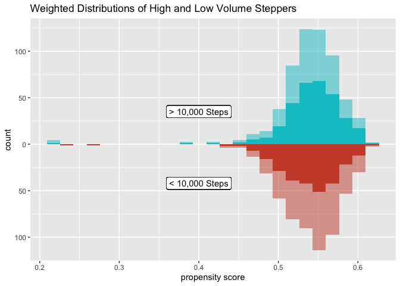<!-- -->

Who are those High Step people with the low propensity scores? I suspect
this has to do with age, but we’ll check it out. We start by sorting
those with low propensity scores (&lt; .45) from lowest to highest, and
see that *age* and *gender* seem to move with propensity score.

``` r
lowps_indiv = dat %>% filter(.fitted < .45) %>% select(stepsT, age, gender, 
                                                       life.score, .fitted)
arrange(lowps_indiv, .fitted)
```

    ## # A tibble: 7 × 5
    ##   stepsT   age gender life.score .fitted
    ##    <dbl> <int> <fct>       <int>   <dbl>
    ## 1      1    40 0              59   0.218
    ## 2      0    36 0              91   0.237
    ## 3      0    35 0              73   0.271
    ## 4      1    24 0             124   0.383
    ## 5      1    25 1              70   0.416
    ## 6      0    24 1              68   0.436
    ## 7      0    24 1              64   0.442

``` r
dat$lowps = ifelse(dat$.fitted > .45, 1, 0)
```

``` r
ggplot(dat, aes(x = age, y = life.score, color = lowps))+
  geom_point()+
  labs(x = "Age", y = "Life Score")+
  ggtitle("Life Score vs. Age with Low Propensity Scores")
```

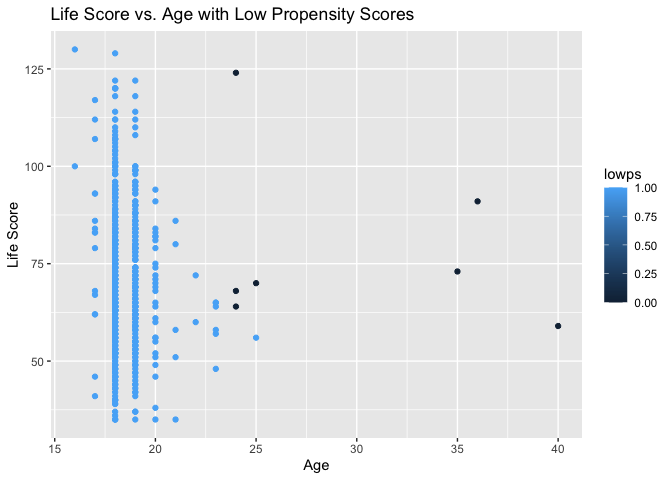<!-- -->

``` r
ggplot(dat, aes(x = age, y = steps, color = lowps))+
  geom_point()+
  labs(x = "Age", y = "Steps")+
  ggtitle("Steps vs. Age with Low Propensity Scores")
```

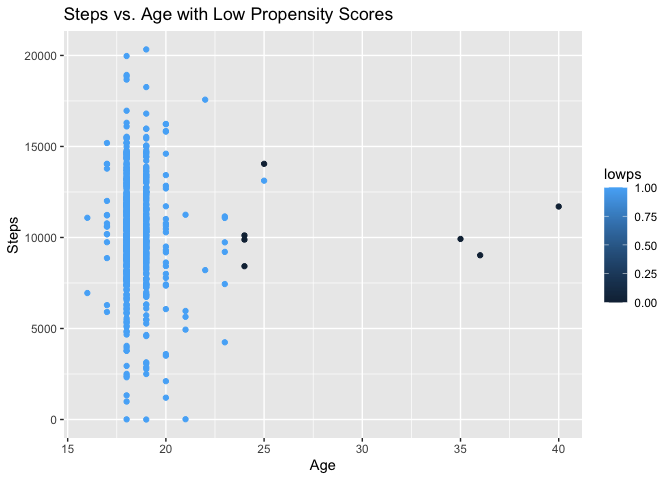<!-- -->

``` r
ggplot(dat, aes(x = gender, y = age, color = lowps))+
  geom_point()+
  labs(x = "Gender", y = "Age")+
  ggtitle("Age vs. Gender with Low Propensity Scores")
```

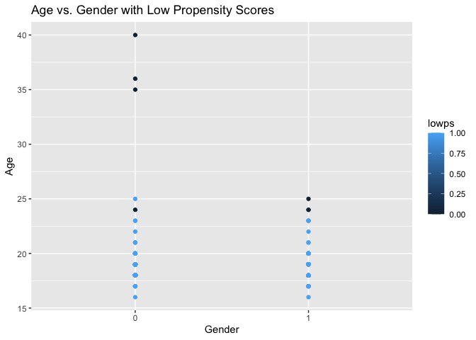<!-- -->

We see that lower propensity scores occur primarily with older students,
and do not seem to be as strongly tied to *gender* or *life score*.
While there are more males (0 indicator) with low propensity scores,
*age* seems to be more relevant. So, when running the propensity score
model with logistic regression, older students are more likely to belong
to the control group, even if they do have a healthy lifestyle, as
indicated by *life score*.

### Checking out the model

Okay, we weighted the populations so that each look like the treated
group, but is it a valid model? We’re going to run some tests to find
out.

#### Love Plot

``` r
# add smds to model
smds = dat %>%
  summarize(
    across(
      c("age", "gender", "life.score"),
      list(unweighted = ~smd(.x, stepsT)$estimate,
           att.weighted = ~smd(.x, stepsT, w_ate)$estimate)
    )
  )

plot_df_smds = smds %>%
  pivot_longer(
    everything(),
    values_to = "SMD",
    names_to = c("variable", "Method"),
    names_pattern = "(.*)_(.*)") %>%
  arrange(desc(Method), abs(SMD)) %>%
  mutate(variable = fct_inorder(variable))

ggplot(
  data = plot_df_smds,
  aes(x = abs(SMD), y = variable,
      group = Method, color = Method)
) +
  geom_line(orientation = "y")+
  geom_point()+
  geom_vline(xintercept = .1,
             color = "black", size = .1)+
  ggtitle("Love Plot ATE vs Unweighted")
```

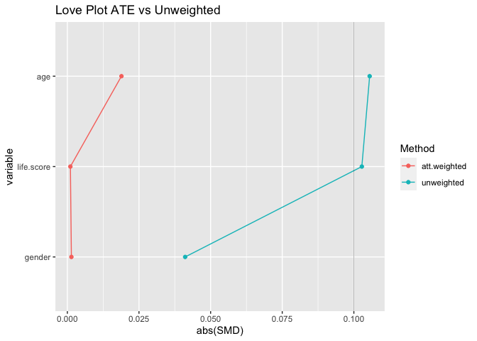<!-- -->

It looks like the weighting brought the covariates closer to balance.
All covariates are far below the rule of thumb 0.1 mark.

#### ECDF

``` r
# create weighted cdf plot for age and income

# df for exposed, age
ecdf_1a = dat %>%
  filter(stepsT == 1) %>%
  arrange(age) %>%
  mutate(cum_pct = cumsum(w_ate)/sum(w_ate))

# df for unexposed, age
ecdf_0a = dat %>%
  filter(stepsT == 0) %>%
  arrange(age) %>%
  mutate(cum_pct = cumsum(w_ate)/sum(w_ate))

#plot
ggplot(ecdf_1a, aes(x = age, y = cum_pct)) +
  geom_line(color = "Turquoise3") +
  scale_color_manual("> 10,000 Steps",
                     values = c("Blue", "Brown"),
                     labels = c("No", "Yes"))+
  geom_line(data = ecdf_0a,
            aes(x = age, y = cum_pct),
            color = "Blue") +
  xlab("Age") +
  ylab("Proportion <= x")+
  ggtitle("Weighted ECDF for Age")
```

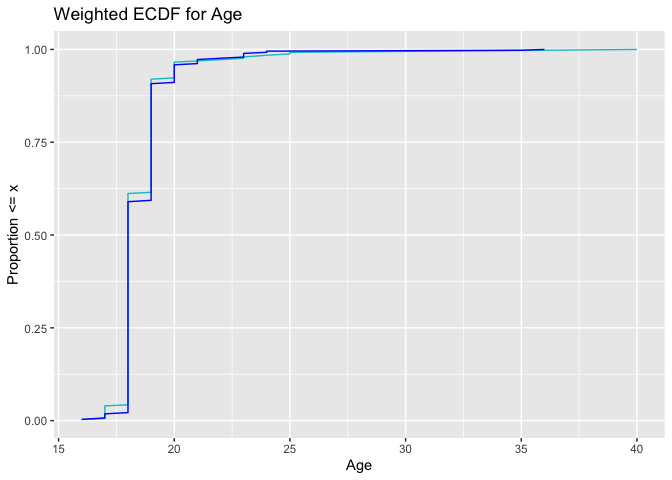<!-- -->

Our continuous variable *age* matches well, both before and after
weighting. There doesn’t seem to be any non-linearity present, so we
will proceed to estimation!

### Causal Estimates

``` r
dat %>%
  summarise(
    ate = sum(gpa*stepsT*w_ate)/sum(stepsT*w_ate) - sum(gpa*(1 - stepsT)*w_ate)/
      sum((1-stepsT)*w_ate)
  )
```

    ## # A tibble: 1 × 1
    ##     ate
    ##   <dbl>
    ## 1 0.500

This is our point estimate. On average, a ORU freshman who had daily
average steps over 10,000 had a GPA 0.5 points higher than a freshman in
the control. That sounds impressive, but how certain are we about this?

``` r
fit_ipw <- function(split) {
  .df <- analysis(split)
  
  # fit propensity score model
  propensity_model <- glm(
    stepsT ~ age + gender + life.score,
    family = binomial(), 
    data = .df
  )
  # calculate inverse probability weights
  .df <- propensity_model %>% 
    
    # get propensity scores 
    augment(type.predict = "response", data = .df) %>% 
    # add ATE to df
    mutate(wts = stepsT / .fitted + (1 - stepsT) / (1  - .fitted)) 
  
  # fit outcome model
  lm(gpa ~ stepsT, data = .df, weights = wts) %>%
    tidy()
}

#fit ipw model
ipw_results = bootstraps(dat, 1000, apparent = TRUE) %>%
  mutate(results = map(splits, fit_ipw))

# get t-statistic-based CIs
boot_estimate = int_t(ipw_results, results) %>%
  filter(term == "stepsT")

boot_estimate
```

    ## # A tibble: 1 × 6
    ##   term   .lower .estimate .upper .alpha .method  
    ##   <chr>   <dbl>     <dbl>  <dbl>  <dbl> <chr>    
    ## 1 stepsT  0.379     0.503  0.626   0.05 student-t

Based on a bootstrap interval, we are 95% confident that the true causal
effect of a daily average of more than 10,000 steps for ORU freshman is
(0.3749, 0.6204). There is strong evidence that high volume daily steps
has a positive impact on a student’s GPA.

### But…What if…?

It seems that, conditioning on *age*, *gender*, and *life score*, we
have a causal effect, but what if we missed a confounder? How would the
model change? It’s time for sensitivity analysis. We are going to look
at different standardized mean differences (SMDs).

``` r
smds = c(.25, .5, .75)
tips1 = tip_lm(effect = .5,
        smd = smds) 
tips1
```

``` r
tips1 %>%
  ggplot()+
  geom_line(aes(x = smds, y = outcome_association))+
  xlab("SMDs") +
  ylab("Outcome Association")+
  ggtitle("Outcome Association vs. SMD")
```

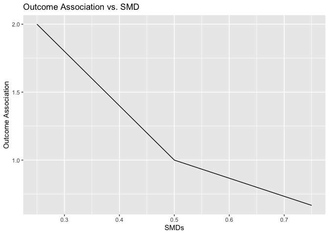<!-- -->

The above analysis uses the point estimate of 0.5 and confidence of 95%.
When the SMD is smaller, measured at 0.25, if we had one missing
(unmeasured) confounder, the confounder would need to have an outcome
association of 2 to “tip” the outcome effect to 0. At this point, the
observed effect would no longer be significant. If the missing
confounder had an SMD of 0.5, it would need an association of 1 to
render the outcome effect null. Along the same lines, with a large SMD
of 0.75, the unmeasured confounder would need an outcome association of
0.667 to negate the outcome effect.

### Next Steps

It’s pretty cool that we found a causal effect, but I wonder, does a
large daily step volume cause some phsyiological change that improves
cognition and therefore GPA? Or is there a behavioral/psychological
link? In other words, what is the causal mechanism? Is there a mediator
or does a high daily step average directly cause the increase in GPA? We
would need to do mediation analysis to determine this.

We need to regress the link between more than 10,000 steps a day and
cognitive function, as well as cognitive function and GPA, then compare
the results to our current causal effect. Ideally, we would create a
randomized controlled experiement to determine the causal effects on
these two paths. First, we could recruit ORU Freshman to the study and
randomly assign them to the treatment of taking on average over 10,000
steps daily or the control. In order to promote adherence to treatment
group behaviors, control group members may receive a scooter or other
device to limit steps. If admissible, automated messages (not monitored
by researchers) could be sent to encourage the exposure group to get
their steps in and the control group to slow down their efforts. After a
semester of the prescribed exposure, participants would undergo
cognitive evaluation in clinic.

It may be more difficult to get a randomized control study to determine
causal effect between cognition and GPA, since we cannot necessarily
assign people the same way. We can’t really say, “You have will have
high cognitive abilities this semester. You, not so much.” This would
have to be another study, regressing the observations, similar to what
we did earlier with the ORU dataset.

#### Sources

Allie M. Broaddus, Brandon J. Jaquis, Colt B. Jones, Scarlet R. Jost,
Andrew S.I.D. Lang, Ailin Li, Qiwen Li, Philip P. Nelson & Esther M.
Spear (2019): Fitbits, field-tests, and grades: The effects of a healthy
and physically active lifestyle on the academic performance of first
year college students, International Journal of Sport and Exercise
Psychology, DOI: 10.1080/1612197X.2019.1623062,
<https://www.tandfonline.com/doi/full/10.1080/1612197X.2019.1623062>
